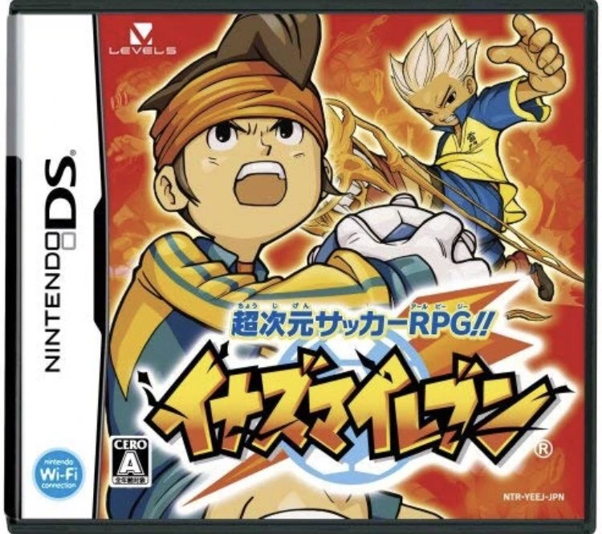
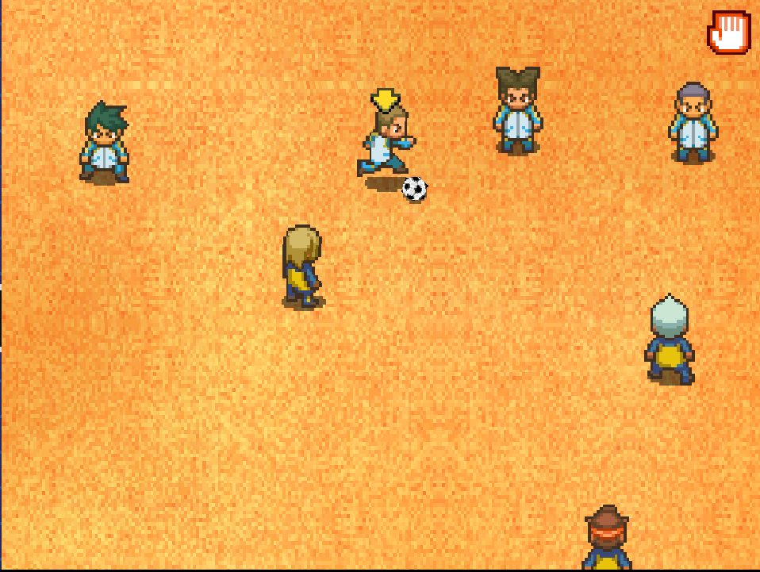

# IE1decomp

Reverse engineering the japanese version of Inazuma Eleven 1 in order to deeply understand its mechanics

## Progress

### To-Do List

everything lmao

## The Project

### Introduction

Inazuma Eleven is a soccer game made by Level-5 on the Nintendo DS.
It was originally released in August 2008 in Japan, and then got remade with an improved engine for an European release in January 2011.

The game makes good use of the DS' touchscreen by basing its entire gameplay using it. You can control how your players move in the field, pass the ball, shoot, use special moves...

There are more than a thousand players you can scout to create your dream team and battle your friends ! At least that was the case in 2012 when people still played the game...

### Goals

My goals with this project are :

- Converting every asset (textures, maps, 3d models) to modern formats (png, obj...)
- Learn how every single game mechanic works (Player AI, Stat Reinforcement, Values behind a fight, Scouting...)
- Make a playable version on PC with some QoL tweaks

### Tools

Here are the tools i will use for this project :

- **Ghidra**, a decompilation software (too broke for IDA Pro)
- **Tinke**, a software to fetch assets from NDS roms

I might use more in the future

## Logs

I will write logs to tell my progress and discoveries on this project

- [Getting Started](log/1gettingstarted.md)
