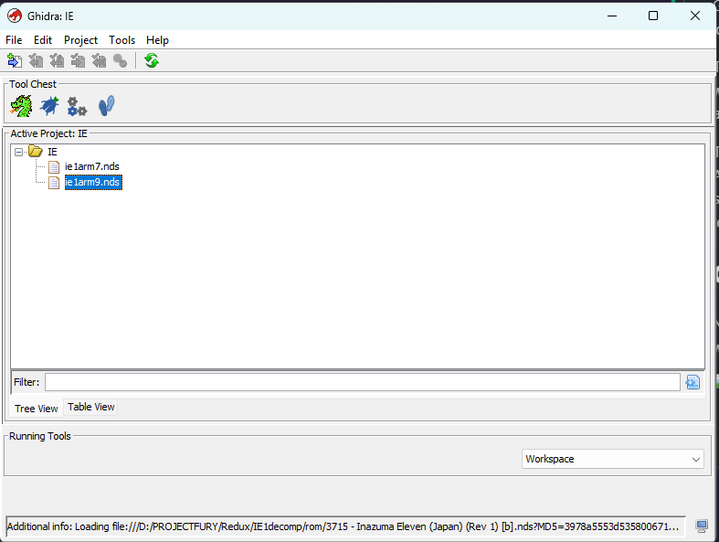

# Log 1 : Getting Started (05/03/2025)

First log before starting everything just to learn some essential things

## The Nintendo DS

Since Inazuma Eleven is a DS game, the code is going to use hardware features that requires knowledge about the DS architecture.

Good news, there's a [whole page](https://www.copetti.org/writings/consoles/nintendo-ds/) written by Rodrigo Copetti that tells a lot about it. Huge shoutout to him !

To sum it up, the DS uses 2 different CPUs at the same time. This means we'll have 2 programs to decompile in order to understand everything about the game.

The 2 CPUs are using the ARM architecture. The main CPU is the ARM946E-S (arm9 for short) and the 2nd one is the ARM7TDMI (arm7 for short) which is the same as the GBA, but with faster speed. There's more technical info in Copetti's page, i'll look at it more deeply when i'll need to.

## Ghidra

Now that we know that, we can import our rom in Ghidra and start working !

However, i'd like to fetch some assets first using Tinke, cause its easier xD

